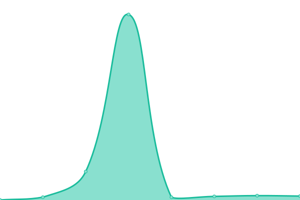
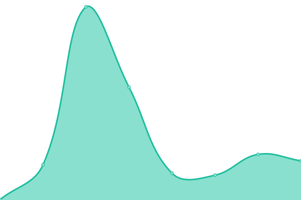
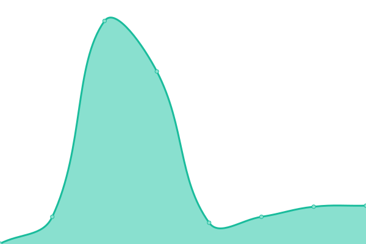
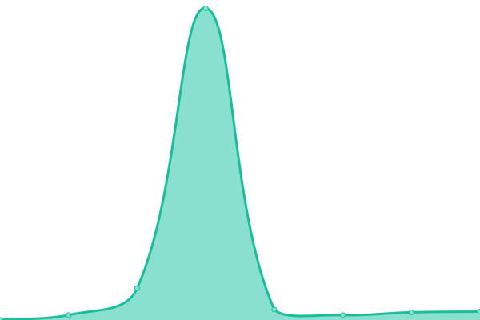

# [📈 Live Status](https://thomaspj10.github.io/codifi-uptime-monitor): <!--live status--> **🟥 Complete outage**

This repository contains the open-source uptime monitor and status page for [Thomas P](https://thomaspj10.github.io/codifi-uptime-monitor), powered by [Upptime](https://github.com/upptime/upptime).

With [Upptime](https://upptime.js.org), you can get your own unlimited and free uptime monitor and status page, powered entirely by a GitHub repository. We use [Issues](https://github.com/thomaspj10/codifi-uptime-monitor/issues) as incident reports, [Actions](https://github.com/thomaspj10/codifi-uptime-monitor/actions) as uptime monitors, and [Pages](https://thomaspj10.github.io/codifi-uptime-monitor) for the status page.

<!--start: status pages-->
<!-- This summary is generated by Upptime (https://github.com/upptime/upptime) -->
<!-- Do not edit this manually, your changes will be overwritten -->
<!-- prettier-ignore -->
| URL | Status | History | Response Time | Uptime |
| --- | ------ | ------- | ------------- | ------ |
|  [Codifi marketing](https://codifi.nl) | 🟥 Down | [codifi-marketing.yml](https://github.com/thomaspj10/codifi-uptime-monitor/commits/HEAD/history/codifi-marketing.yml) | 

 77ms
     
 | 

<a href="https://thomaspj10.github.io/codifi-uptime-monitor/history/codifi-marketing">0.00%</a>
    

|  [Marktplaats](https://marktplaats.codifi.nl) | 🟥 Down | [marktplaats.yml](https://github.com/thomaspj10/codifi-uptime-monitor/commits/HEAD/history/marktplaats.yml) | 

 66ms
     
 | 

<a href="https://thomaspj10.github.io/codifi-uptime-monitor/history/marktplaats">0.00%</a>
    

|  [Dashboard](https://dashboard.codifi.nl) | 🟥 Down | [dashboard.yml](https://github.com/thomaspj10/codifi-uptime-monitor/commits/HEAD/history/dashboard.yml) | 

 72ms
     
 | 

<a href="https://thomaspj10.github.io/codifi-uptime-monitor/history/dashboard">0.00%</a>
    

|  [Repository](https://repository.codifi.nl) | 🟥 Down | [repository.yml](https://github.com/thomaspj10/codifi-uptime-monitor/commits/HEAD/history/repository.yml) | 

 73ms
     
 | 

<a href="https://thomaspj10.github.io/codifi-uptime-monitor/history/repository">0.00%</a>
    

|  [Registry](https://registry.codifi.nl) | 🟥 Down | [registry.yml](https://github.com/thomaspj10/codifi-uptime-monitor/commits/HEAD/history/registry.yml) | 

 75ms
     
 | 

<a href="https://thomaspj10.github.io/codifi-uptime-monitor/history/registry">0.00%</a>
    

<!--end: status pages-->

[**Visit our status website →**](https://thomaspj10.github.io/codifi-uptime-monitor)

## 📄 License

- Powered by: [Upptime](https://github.com/upptime/upptime)
- Code: [MIT](./LICENSE) © [Anand Chowdhary](https://anandchowdhary.com), supported by [Pabio](https://pabio.com)
- Data in the `./history` directory: [Open Database License](https://opendatacommons.org/licenses/odbl/1-0/)
